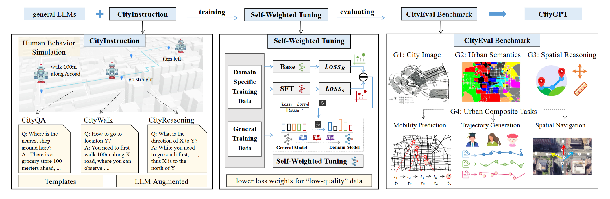

# CityGPT

This repo is for CityGPT: Empowering Urban Spatial Cognition of Large Language Models

## 📢 News

- 🎉: (2025.05) CityGPT has been accepted to **KDD 2025 Research Track**.
- 🎉: (2025.06) The next-generation urban foundation model based on CityGPT, [UrbanLLaVA](https://github.com/tsinghua-fib-lab/UrbanLLaVA), which introduces multi-modal capabilities, has been accepted to **ICCV 2025**.

## Introduction

In this paper, we propose ***CityGPT***, a systematic framework designed to enhance LLMs' understanding of urban space and improve their ability to solve the related urban tasks by integrating a city-scale \`world model' into the model. Firstly, we construct a diverse instruction tuning dataset, ***CityInstruction***, for injecting urban knowledge into LLMs and effectively boosting their spatial reasoning capabilities. Using a combination of CityInstruction and open source general instruction data, we introduce a novel and easy-to-use self-weighted fine-tuning method (***SWFT***) to train various LLMs (including ChatGLM3-6B, Llama3-8B, and Qwen2.5-7B) to enhance their urban spatial capabilities without compromising even improving their general abilities. Finally, to validate the effectiveness of our proposed framework, we develop a comprehensive text-based spatial benchmark ***CityEval*** for evaluating the performance of LLMs across a wide range of urban scenarios and geospatial tasks. Extensive evaluation results demonstrate that smaller LLMs trained with CityInstruction by SWFT method can achieve performance that is competitive with, and in some cases superior to, proprietary LLMs when assessed using CityEval. Our work highlights the potential for integrating spatial knowledge into LLMs, thereby expanding their spatial cognition abilities and applicability to the real-world physical environments.

## 🌍 Framework

An overview of CityGPT, including CityInstruction,SWFT and CityEval. We can select any city around the world to automatically build new dataset and benchmark for it.


### 🌆 Supported Cities

Currently, the following regions are supported.


| World    | Regions | Roads |  PoIs  | AoIs |
| :------- | :------ | :---: | :----: | :---: |
| Asia     | Beijing | 37985 | 48874 | 13013 |
| Europe   | London  | 17787 | 515713 | 27280 |
| Europe   | Paris   | 2840 | 224589 | 4033 |
| Americas | NewYork | 12680 | 567972 | 13773 |

## ⌨️ Codes Structure

- simulate      # codes for constructing training dataset
- LLAMA-Factory # modified codes for fine-tuning models with SWFT
- evaluate      # evaluation codes
- resource      # basic data of regions
- config.py     # global variables in project

## 🔧 Installation

Install Python dependencies.

```bash
conda create -n citygpt python==3.10
pip install -r requirements.txt
```

## 🤖 LLM Support

For using LLM API, you need to set API Key as follows

```
export OpenAI_API_KEY = ""         # For OpenAI GPT3.5, GPT4, GPT4o
export DeepInfra_API_KEY = ""        # For LLama3, Gemma, Mistral
export SiliconFlow_API_KEY = ""        # For ChatGLM
```

Besides, we use [vllm](https://github.com/vllm-project/vllm) for local LLM deployment.

## Stage1: Constructing Training Data

Please first set the relevant parameters according to the instructions in `config.py`.

### Existing Dataset of 4 Cities

We provide the alpaca-format CityInstruction dataset for the existing 4 cities respectively. To access the dataset, please refer to [CityGPT-Data-huggingface](https://huggingface.co/datasets/Tianhui-Liu/CityGPT-Data).

### Building a New Region Dataset (optional)

If you want to construct a dataset for new regions, please follow the instruction below:

Please first navigate to the root directory by using the cd command: `cd CityGPT`

#### Basic Data Generation

We provide a script for generating data(including Roads/PoIs/AoIs) in new regions. You need to first define the latitude and longitude range for a city's area in `config.py`, and then run the following command.

```bash
python -m simulate.utils
```

We provide a script that can generate custom-built address for PoI/AoI as well as address directly obtained from OSM.

```bash
python -m simulate.address_system
```

#### CityWalk Construction

First, it is necessary to randomly generate the start and end points of the navigation paths. Please note that the files generated in this step are also required for the  construction of CityQA.

```bash
python -m simulate.train_task
```

In `config.py`, there are 4 parameters related to the CityWalk format. In the training data used for our paper, we utilize the following two versions:

* `EVAL_DATA = False & LANDMARK_DATA = True`
* `EVAL_DATA = False & LANDMARK_DATA = False & DETAIL_INTEREST = True`

In the generation of training data CityReasoning and evaluation benchmark CityEval, the following configuration is also used. Please note that when generating these types of data, make sure to set `DATA_VERSION = "eval"` at the same time.

* `EVAL_DATA = True`

Please first set the desired data parameters in `config.py` according to your needs, and then run the following command.

```bash
python -m simulate.run_simulate_parallel
```

The `run_simulate_parallel.py` script sequentially executes the two codes, `agent.py` and `process.py`, while simulating them in parallel.

#### CityQA Construction

We provide the script for generating the CityQA dataset in parallel. If you want to obtain the dataset more quickly, please run the parallel version of the code directly.

```bash
# Parallel execution
python -m simulate.run_address_data_parallel
```

#### CityReasoning construction

We provide the script to generate the CityReasoning dataset for each task, you can obtain the dataset as the following examples:

```bash
python -m simulate.reasoning_gen
```

Once the above command is executed, you can find the generated training dataset in the `simulate/examples` folder.

## Stage2: SWFT Models

We have implemented training improvements based on the [LLaMA-Factory-v0.8.3](https://github.com/hiyouga/LLaMA-Factory) framework.

### Fine-tuning Data Preparation (optional)

We provide a script to convert CityInstruction into Alpaca format. You can set the data to be mixed for SWFT in `train/scripts/data_process.py`, and then run the script.

```bash
python -m LLAMA-Factory.scripts.data_process
```

### SWFT Methods

After setting the parameters, you can use the following script to compute the perplexity (PPL) of the base model or the SFT model for each sample in the specified dataset.

```bash
./LLAMA-Factory/scripts/cal_ppl.sh
```

It is worth noting that for datasets used in SWFT, each sample must have a `ratio` key indicating its weight. Additionally, the corresponding entry in the `LLAMA-Factory/data/dataset_info.json` file must also include `ratio` under the `columns` key. We have provided an example in that file.

We provide the SWFT (Self-Weighted Fine-Tuning) script. Please adjust the parameters in `examples/train_full/full_sft_ds3.yaml` as needed before executing the command below.

```bash
./LLAMA-Factory/run_sft.sh
```

## Stage3: Running CityEval Evaluation

### Evaluation Data Preparation

#### Existing Evaluation Tasks of 4 Cities

We provide the CityEval dataset for the existing 4 cities respectively. To access the dataset, please refer to [CityGPT-Data-huggingface](https://huggingface.co/datasets/Tianhui-Liu/CityGPT-Data).

#### Building CityEval Benchmark for a New City (optional)

If you want to expand the CityEval benchmark for a new area, please run the following command.

```bash
python -m evalaute.task_gen
```

You can find the newly generated tasks in the `evaluate/city_eval/tasks` folder.

### Run the Model Evaluation

#### CI/US/SR Evaluation

We provide a script for evaluation, and the following is an example of how to run it.

```bash
python -m evaluate.city_eval.run_eval \
    --model_name=GPT4o \
    --max_tokens=500 \
    --temperature=0 \
    --city_eval_version=v2.3 \
    --max_valid=50  \
    --workers=20 \
    --auto_multi \
    --include_answer_prompt_final
```

Here are some new parameters that need to be introduced:

* max\_valid: Refers to the number of examples per task during evaluation.
* include\_answer\_prompt\_final: Adds an "Answer" suffix at the end of the prompt.
* workers: Determines the number of parallel processes.
* auto\_multi: Automatically decides whether to use multi-turn evaluation based on rules.

#### Composite Tasks Evaluation

We provide scripts for three tasks: mobility prediction, trajectory generation, and spatial navigation.

```bash
# For task Mobility Prediction
python -m evaluate.agent.prediction.eval --model=LLama3-8B --mode=gen_answer
# For task Trajectory Generation
python -m evaluate.agent.generation.eval
# For task Spatial Navigation
python -m evaluate.agent.navigation.eval

```

#### General Evaluation

We provide a script for the general evaluation tool OpenCompass-v0.3.9 in `evaluate/scripts/run.sh`. You can move it to the submodule, modify the content, and run it.

```bash
./evaluate/opencompass-0.3.9/run.sh
```

## 🌟 Citation

If you find this work helpful, please cite our paper.

```latex
@inproceedings{feng2025citygpt,
title={CityGPT: Empowering Urban Spatial Cognition of Large Language Models},
author={Feng, Jie and Liu, Tianhui and Du, Yuwei and Guo, Siqi and Lin, Yuming and Li, Yong},
booktitle = {Proceedings of the 31th ACM SIGKDD International Conference on Knowledge Discovery and Data Mining},
year = {2025}
}
```

## 👏 Acknowledgement

We appreciate the following GitHub repos a lot for their valuable code and efforts.

- https://github.com/hiyouga/LLaMA-Factory for fine-tuning model
- https://github.com/THUDM/AgentTuning for multi-choice evaluation
- https://github.com/xlwang233/LLM-Mob for urban mobility prediction

## 📩 Contact

If you have any questions or want to use the code, feel free to contact:
Jie Feng (fengjie@tsinghua.edu.cn)
